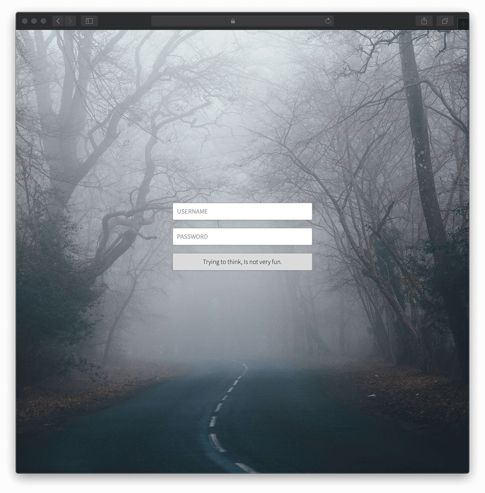

# Cloud9 IDE v2

As of 14th of February 2015 with a commit that can no longer be linked to, the upstream author Cloud9 IDE, Inc stated that the Cloud9 v2 would no longer be maintained. The original repository issue tracker was closed and notifications were given that the project is superseded by [Cloud9 v3 SDK](https://github.com/c9/core/) with some substantial changes in licensing terms driven by alignment of business goals.

This repository is the maintenance fork for the original Cloud9 IDE that people grew to love. The v3 development is continuing strong but there are many changes to the original approach:

- The emphasis is on the development of [c9.io](http://c9.io) cloud-hosted service
- The on-premises solution will be a separately licensed product
- The distributed SDK is meant for plugin development
- The core of the product is [no longer licensed as Open Source Software](http://cloud9-sdk.readme.io/v0.1/docs/the-licenses-for-cloud9-sdk-and-packages)

That being said, v3 will include much more features and will surely over time become a very solid and mature offering. Further more, the license allows the SDK version to be used as a personal editor. However, it is strictly prohibited to:

- Use the SDK to build or offer a service
- Make the SDK version easily available to anyone else besides yourself

If it feels like these are limiting factors for you, you are welcome to try Cloud9 v2, which is licensed under GPL version 3.

## About

Cloud9 is an open source IDE built with [Node.JS] on the back-end and JavaScript/HTML5 on the client. The version available here runs on your local system. Cloud9 balances the power of traditional desktop IDEs with the simplicity and elegance of editors like TextMate and Sublime.

Cloud9 is built entirely on a web stack, making it the most hacker-friendly IDE today. Fork it, hack it, and if you think others would benefit, file a pull request on this repo or create an issue.

## Fork Extras

- Modern node support (NodeJS >= 0.10+)
- Up to date dependencies and compatibility fixes
- Terminal

### Screenshot

## Features

  * High performance ACE text editor with bundled syntax highlighting support for JS, HTML, CSS and mixed modes.
  * Integrated debugger for [Node.JS] applications with views of the call stack, variables, live code execution and live inspector
  * Advanced JavaScript language analysis marking unused variables, globals, syntax errors and allowing for variable rename
  * Local file system is exposed through [WebDAV](http://en.wikipedia.org/wiki/WebDAV) to the IDE, which makes it possible to connect to remote workspaces as well
  * Highly extensible through both client-side and server-side plugins
  * Sophisticated process management on the server with evented messaging

## Browser Support

We support the newer versions of Chrome, Firefox and Safari.

## Installation and Usage

If installing on Windows, please refer to [Installation on Windows](#installation-on-windows-experimental).

Requirements (>= 2.1.0):

  * NodeJS `>= 0.10.0`
  * g++-4.8

Install:

    git clone https://github.com/exsilium/cloud9.git
    cd cloud9
    npm install

The above install steps create a `cloud9` directory with a `bin/cloud9.sh`
script that can be used to start Cloud9:

    bin/cloud9.sh

Optionally, you may specify the directory you'd like to edit:

    bin/cloud9.sh -w ~/git/myproject

Cloud9 will be started as a web server on port `-p 3131`, you can access it by
pointing your browser to: [http://localhost:3131](http://localhost:3131)

By default Cloud9 will only listen to localhost.
To listen to a different IP or hostname, use the `-l HOSTNAME` flag.
If you want to listen to all IP's:

    bin/cloud9.sh -l 0.0.0.0

If you are listening to all IPs it is advised to add authentication to the IDE.
You can either do this by adding a reverse proxy in front of Cloud9,
or use the built in basic authentication through the `--username` and `--password` flags.

    bin/cloud9.sh --username leuser --password c9isawesome

Cloud9 is compatible with all connect authentication layers,
to implement your own, please see the `plugins-server/cloud9.connect.basic-auth` plugin
on how we added basic authentication.

## Installation on Windows (experimental)

If you are on Windows Insider Program, use the Bash on Windows feature to install Cloud9.

Install [NVM](https://github.com/creationix/nvm) to manage node versions. Install a node version to your liking. The following is needed to install the needed build tools:

    sudo apt-get update
	sudo apt-get install build-essential

Clone the Cloud9 repo to your machine and run npm:

    npm install
    make worker
    node server.js -w ./ -l 0.0.0.0 -a x-www-browser

## Updating

To update to the latest version (if this doesn't work, just make a fresh clone):

    git pull
    npm update

`npm update` does not currently install missing dependencies. To do so use:

    npm install

## Open Source Projects Used

The Cloud9 IDE couldn't be this cool if it weren't for the wildly productive
[Node.JS] community producing so many high quality software.
Main projects that we use as building blocks:

  * [async.js] by [fjakobs]
  * [jsDAV] by [mikedeboer]
  * [connect] by [senchalabs](http://github.com/senchalabs)
  * [engine.io] by [LearnBoost](http://github.com/LearnBoost)
  * [smith.io](http://github.com/c9/smith.io) by [creationix](http://github.com/creationix) & [cadorn](http://github.com/cadorn)
  * [ace](http://github.com/ajaxorg/ace) by [fjakobs]
  * [apf](http://www.ajax.org) by [ajax.org]
  * and of course [Node.JS]!

Thanks to all developers and contributors of these projects!

[fjakobs]: http://github.com/fjakobs
[javruben]: http://github.com/javruben
[mikedeboer]: http://github.com/mikedeboer
[ajax.org]: http://www.ajax.org/
[async.js]: http://github.com/fjakobs/async.js
[jsDAV]: http://github.com/mikedeboer/jsdav
[connect]: http://github.com/senchalabs/connect
[engine.io]: http://github.com/LearnBoost/engine.io
[requireJS]: http://requirejs.org/
[Node.JS]: http://nodejs.org/

## License

The GPL version 3, read it at [http://www.gnu.org/licenses/gpl.txt](http://www.gnu.org/licenses/gpl.txt)

## Contributing

Open new issue for discussions and/or feel free to submit a pull request against the development branch
