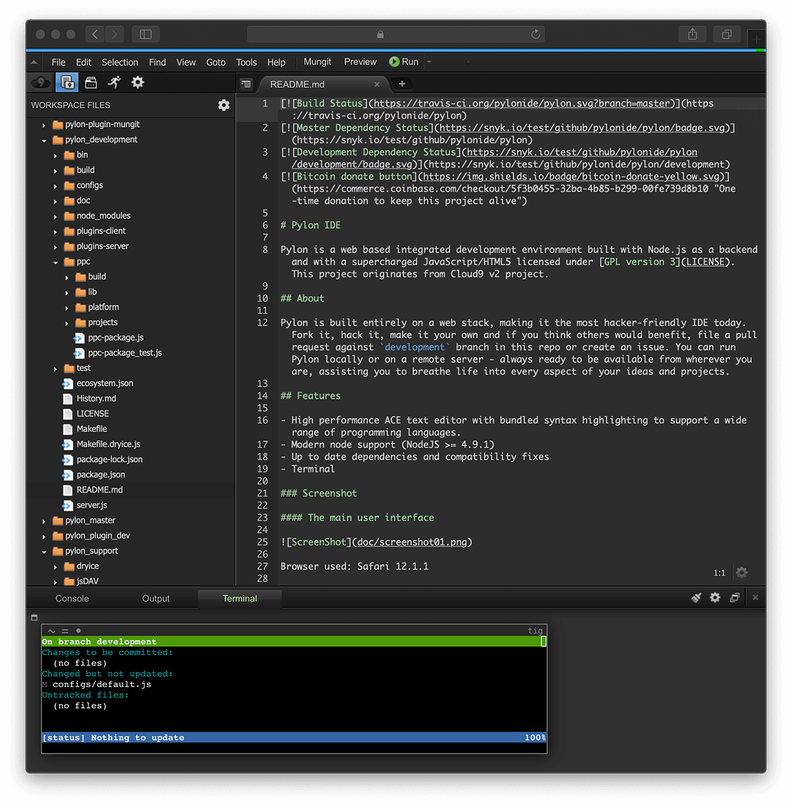
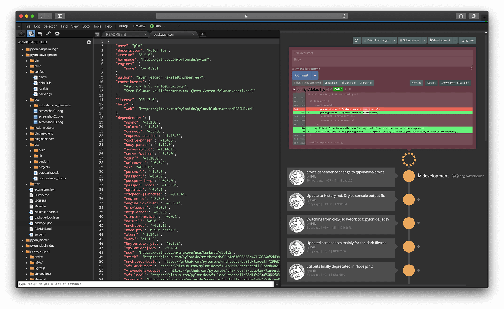

# Pylon IDE

Pylon is a web based integrated development environment built with Node.js as a backend and with a supercharged JavaScript/HTML5 licensed under [GPL version 3](LICENSE). This project originates from Cloud9 v2 project.

## About

Pylon is built entirely on a web stack, making it the most hacker-friendly IDE today. Fork it, hack it, make it your own and if you think others would benefit, file a pull request against `development` branch in this repo or create an issue. You can run Pylon locally or on a remote server - always ready to be available from wherever you are, assisting you to breathe life into every aspect of your ideas and projects.

## Features

- High performance ACE text editor with bundled syntax highlighting to support a wide range of programming languages.
- Modern node support (NodeJS >= 4.9.1)
- Up to date dependencies and compatibility fixes
- Terminal

### Screenshot

## Browser Support

Moderns versions of Chrome and Safari are supported. Firefox, altough functional, no longer works as intended as of version 64.0 - future efforts will be made to restore compatibility.

### Basic iPad Pro support with keyboard

As of v2.3.0 efforts have been made to make Pylon usable with iPad. However, for a smoother ride, some keyboard settings needs to be changed:

- Settings -> General -> Keyboard -> Auto-Correction -> `Off`
- Settings -> General -> Keyboard -> Smart Punctuation -> `Off` (interferes with coding by changing quotes)
- Settings -> General -> Keyboard -> Shortcuts -> `Off` (interferes by displaying bottom bar that hides the console prompt)

## Installation and Usage

If installing on Windows, please refer to [Installation on Windows](#installation-on-windows-experimental).

Requirements (>= 2.3.0):

  * NodeJS `>= 4.9.1`
  * g++-4.9 (Required for node-pty compilation)
  * make (Required for node-pty compilation)
  * python (Required for node-pty compilation)

Install:

    git clone https://github.com/pylonide/pylon.git
    cd pylon
    npm i

The above install steps creates a `pylon` directory with a `bin/pylon.sh`
script that can be used to start Pylon:

    bin/pylon.sh

Optionally, you may specify the directory you'd like to edit:

    bin/pylon.sh -w ~/git/myproject

Pylon will be started as a web server on port `-p 3131`, you can access it by
pointing your browser to: [http://localhost:3131](http://localhost:3131)

By default Pylon will only listen to localhost.
To listen to a different IP or hostname, use the `-l HOSTNAME` flag.
If you want to listen to all IP's:

    bin/pylon.sh -l 0.0.0.0

If you are listening to all IPs it is advised to add authentication to the IDE.
You can either do this by adding a reverse proxy in front of Pylon,
or use the built in basic authentication through the `--username` and `--password` flags.

    bin/pylon.sh --username leuser --password plnisawesome

Pylon is compatible with all connect authentication layers,
to implement your own, please see the `plugins-server/cloud9.connect.basic-auth` plugin
on how we added basic authentication.

## Installation on Windows (experimental)

If you are on Windows Insider Program, use the Bash on Windows feature to install Pylon.

Install [NVM](https://github.com/creationix/nvm) to manage node versions. Install a node version to your liking. The following is needed to install the needed build tools:

    sudo apt-get update
    sudo apt-get install build-essential

Clone the Pylon repo to your machine and run npm:

    npm install
    make worker
    node server.js -w ./ -l 0.0.0.0 -a x-www-browser

## Updating

To update to the latest version (if this doesn't work, just make a fresh clone):

    git pull
    npm update

## Creating your own Plugins

Pylon functionality is all created around server and client-side plugins.
However, there is hardly any documentation about the APIs to create your own
plugins. To get you started, please see [exsilium/cloud9-plugin-ungit](https://github.com/exsilium/cloud9-plugin-ungit)
to see how to get started for a client-side only plugin.

Going forward, there will be efforts made to sort out the documentation and
write some tutorials to make it more easier to get started.

## License

The [GPL v3](LICENSE).

## Contributing

Open new issue for discussion and/or feel free to submit a pull request against the `development` branch.
